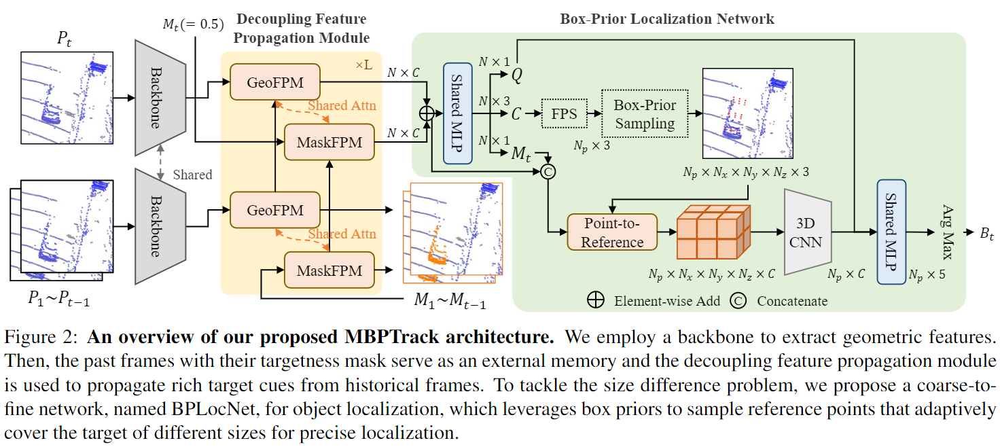

# MBPTrack: Improving 3D Point Cloud Tracking with Memory Networks and Box Priors (ICCV2023)

The official code release of [MBPTrack: Improving 3D Point Cloud Tracking with Memory Networks and Box Priors](https://arxiv.org/pdf/2303.05071.pdf).

An open source platform for general 3D single object tracking, based on [Open3DSOT](https://github.com/Ghostish/Open3DSOT) and our previous work [CXTrack3D](https://github.com/slothfulxtx/cxtrack3d).

## Introduction

3D single object tracking has been a crucial problem for decades with numerous applications such as autonomous driving. Despite its wide-ranging use, this task remains challenging due to the significant appearance variation caused by occlusion and size differences among tracked targets. To address these issues, we present **MBPTrack**, which adopts a **M**emory mechanism to utilize past information and formulates localization in a coarse-to-fine scheme using **B**ox **P**riors given in the first frame. Specifically, past frames with targetness masks serve as an external memory, and a transformer-based module propagates tracked target cues from the memory to the current frame. To precisely localize objects of all sizes, MBPTrack first predicts the target center via Hough voting. By leveraging box priors given in the first frame, we adaptively sample reference points around the target center that roughly cover the target of different sizes. Then, we obtain dense feature maps by aggregating point features into the reference points, where localization can be performed more effectively. Extensive experiments demonstrate that MBPTrack achieves state-of-the-art performance on KITTI, nuScenes and Waymo Open Dataset, while running at 50 FPS on a single RTX3090 GPU.  



## Setup

### Dependencies

Here we list the most important part of our dependencies

| Dependency        | Version                    |
| ----------------- | -------------------------- |
| open3d            | 0.15.2                     |
| python            | 3.8.0                      |
| pytorch           | 1.8.0(cuda11.1,cudnn8.0.5) |
| pytorch-lightning | 1.5.10                     |
| pytorch3d         | 0.6.2                      |
| shapely           | 1.8.1                      |
| torchvision       | 0.9.0                      |

Others can be seen in [Open3DSOT](https://github.com/Ghostish/Open3DSOT)

### KITTI

- Download the data for [velodyne](http://www.cvlibs.net/download.php?file=data_tracking_velodyne.zip), [calib](http://www.cvlibs.net/download.php?file=data_tracking_calib.zip) and [label_02](http://www.cvlibs.net/download.php?file=data_tracking_label_2.zip) from [KITTI Tracking](http://www.cvlibs.net/datasets/kitti/eval_tracking.php).

- Unzip the downloaded files.

- Put the unzipped files under the same folder as following.

  ```
  [Parent Folder]
  --> [calib]
      --> {0000-0020}.txt
  --> [label_02]
      --> {0000-0020}.txt
  --> [velodyne]
      --> [0000-0020] folders with velodynes .bin files
  ```

### Waymo Open Dataset

- We follow the benchmark created by [LiDAR-SOT](https://github.com/TuSimple/LiDAR_SOT) based on the waymo open dataset. You can download and process the waymo dataset as guided by [LiDAR_SOT](https://github.com/TuSimple/LiDAR_SOT), and use our code to test model performance on this benchmark.
- The following processing results are necessary

```
[waymo_sot]
    [benchmark]
        [validation]
            [vehicle]
                bench_list.json
                easy.json
                medium.json
                hard.json
            [pedestrian]
                bench_list.json
                easy.json
                medium.json
                hard.json
    [pc]
        [raw_pc]
            Here are some segment.npz files containing raw point cloud data
    [gt_info]
        Here are some segment.npz files containing tracklet and bbox data
```

### NuScenes

- We follow [M2-Track](https://github.com/Ghostish/Open3DSOT) to prepare NuScenes dataset, which is **quite different** from our previous work [CXTrack3D](https://github.com/slothfulxtx/cxtrack3d). 

- Download the dataset from the [download page](https://www.nuscenes.org/download)

- Extract the downloaded files and make sure you have the following structure:

  ```
  [Parent Folder]
    samples	-	Sensor data for keyframes.
    sweeps	-	Sensor data for intermediate frames.
    maps	        -	Folder for all map files: rasterized .png images and vectorized .json files.
    v1.0-*	-	JSON tables that include all the meta data and annotations. Each split (trainval, test, mini) is provided in a separate folder.
  ```

> Note: We use the **train_track** split to train our model and test it with the **val** split. Both splits are officially provided by NuScenes. During testing, we ignore the sequences where there is no point in the first given bbox.

## Get Started

### Training

To train a model, you must specify the `.yaml` file. The `.yaml` file contains all the configurations of the dataset and the model. We provide `.yaml` files under the [configs/](./configs) directory. 

**Note:** Before running the code, you will need to edit the `.yaml` file by setting the `data_root_dir` argument as the correct root of the dataset.

```
python main.py configs/mbptrack_kitti_ped_cfg.yaml --gpus 0 1
```

### Testing

To test a trained model, specify the checkpoint location with `--resume_from` argument and set the `--phase` argument as `test`.

We provide all pretrained models [here](https://drive.google.com/drive/folders/1bYa_oLTbQcnm-wQO89Dv5km8HH_GIqSv?usp=drive_link) to reproduce the performance reported in our paper (if nothing goes wrong😀).

```
python main.py configs/mbptrack_kitti_ped_cfg.yaml --phase test --resume_from pretrained/mbptrack_kitti_ped.ckpt
```

## Acknowledgement

- This repo is heavily built upon [Open3DSOT](https://github.com/Ghostish/Open3DSOT) and [STNet](https://github.com/fpthink/STNet).

## License

This repository is released under MIT License (see LICENSE file for details).